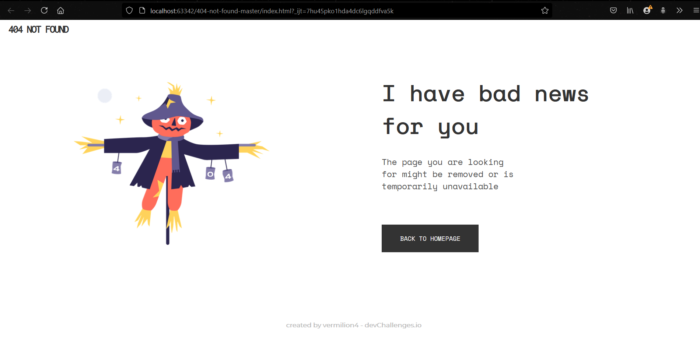

<!-- Please update value in the {}  -->

<h1 align="center">{404 NOT FOUND}</h1>

   Solution for a challenge from  <a href="http://devchallenges.io" target="_blank">Devchallenges.io</a>.

  <h3>
    <a href="https://{https://vermilion4.github.io/404-not-found}">
      Demo
    </a>
     | 
    <a href="https://{https://github.com/vermilion4/404-not-found}">
      Solution
    </a>
     | 
    <a href="https://devchallenges.io/challenges/wBunSb7FPrIepJZAg0sY">
      Challenge
    </a>
  </h3>

<!-- TABLE OF CONTENTS -->

## Table of Contents

- [Overview](#overview)
  - [Built With](#built-with)
- [Contact](#contact)

<!-- OVERVIEW -->

## Overview

### Built With

<!-- This section should list any major frameworks that you built your project using. Here are a few examples.-->

- Semantic HTML5 markup
- CSS custom properties
- CSS FlexBox
- Mobile-first workflow

## Contact

- Website - [vermilionhost](https://www.vermilionhost.site)
- Frontend Mentor - [@vermilion4](https://www.frontendmentor.io/profile/vermilion4)
- Github - [vermilion4](https://github.com/vermilion4)
- LinkedIn - [Adaeze Ndupu](https://www.linkedin.com/in/adaeze-ndupu-31ab42176?lipi=urn%3Ali%3Apage%3Ad_flagship3_profile_view_base_contact_details%3B35uS0ATKTSiUyVj83jbmJA%3D%3D)
